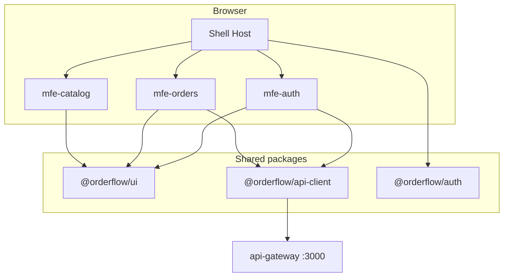

# OrderFlow: микрофронтенды

Архитектура клиентской части OrderFlow: shell + remote-приложения, общий UI kit и единая точка входа в API.

**Связанные документы:**

- [backend/docs/project-blueprint.md](../../backend/docs/project-blueprint.md) — архитектура backend
- [ui-kit.md](./ui-kit.md) — собственная дизайн-система `@orderflow/ui`
- [backend/docs/local-dev-routine.md](../../backend/docs/local-dev-routine.md) — запуск backend локально

---

## 1. Зачем микрофронтенды в этом проекте

OrderFlow — учебный, но **production-like** полигон. На фронте мы повторяем то, как растут продукты в компаниях:

- одна **оболочка (shell)** — layout, навигация, auth, роутинг;
- несколько **независимых приложений (remotes)** по доменам — auth, заказы, каталог;
- общие **пакеты** — UI kit, API-клиент, auth-утилиты;
- **один backend entrypoint** — `api-gateway`, без прямых вызовов микросервисов из браузера.

Цель: не «красивый демо-лендинг», а клиент, через который можно пройти полный сценарий: **login → заказ → статус CONFIRMED**.

---

## 2. Принципы (как в enterprise)

| Принцип | Что это значит для OrderFlow |
|---------|------------------------------|
| **API только через gateway** | `VITE_API_URL=http://localhost:3000`, пути `/api/v1/...` |
| **Домен = remote** | Команда «заказы» владеет `mfe-orders`, не лезет в код auth |
| **Минимум shared state** | Нет общего Redux между remotes; auth и server state — через пакеты/shell |
| **Копируемый UI kit** | Компоненты живут в репозитории (`packages/ui`), не в npm «чёрном ящике» |
| **Инкременты** | Сначала shell + auth + orders; catalog — когда готов `catalog-service` |
| **Версионирование remotes** | В prod каждый remote — отдельный артефакт (`remoteEntry.js`) |

---

## 3. Целевая схема



**Поток запроса:** компонент в remote → `@orderflow/api-client` → gateway → нужный микросервис.

---

## 4. Стек (2026)

| Слой | Технология | Комментарий |
|------|------------|-------------|
| Monorepo | **pnpm** + **Turborepo** | один lockfile, кэш сборок |
| UI | **React 19** + **TypeScript** | стандарт для product teams |
| Сборка | **Vite 6** | host и remotes |
| Microfrontends | **Module Federation** (`@module-federation/vite`) | lazy-load remotes в runtime |
| Стили | **Tailwind CSS 4** + **CSS variables** (токены) | см. [ui-kit.md](./ui-kit.md) |
| Server state | **TanStack Query v5** | список заказов, polling статуса |
| Routing | **React Router 7** | маршруты в shell, remotes монтируются на path |
| Формы | **React Hook Form** + **Zod** | login, create order |
| Lint/format | **Biome** | быстрее связки ESLint + Prettier |
| E2E (позже) | **Playwright** | сценарий до `CONFIRMED` |

**Сознательно не используем на старте:** Next.js на каждый remote, GraphQL, общий Redux store между MFE.

---

## 5. Структура репозитория

```text
/
  backend/                 # микросервисы, infra, shared Go/Node libs
    services/
    infra/compose/
    packages/
  client/                  # фронтенд monorepo (shell + MFE + UI kit)
    apps/
      shell/
      mfe-auth/
      mfe-orders/
    packages/
      ui/
      api-client/
      auth/
  docs/                    # git-workflow (общее)
  backend/
    docs/                  # blueprint, local-dev, observability
    scripts/               # dev-up.ps1 и др.
```

Каждый `mfe-*` — отдельное Vite-приложение со своим `dev`-портом; shell подключает `remoteEntry` через Module Federation.

---

## 6. Remotes и маршруты

| Remote | Dev port (пример) | Маршруты | API (gateway) | Статус |
|--------|-------------------|----------|---------------|--------|
| **shell** | 4000 | layout, `*`, error boundaries | — | готово |
| **mfe-auth** | 4101 | `/login`, `/register` | `POST /api/v1/auth/*` | готово |
| **mfe-orders** | 4102 | `/orders`, `/orders/:id` | `GET/POST /api/v1/orders` | готово |
| **mfe-catalog** | 4103 | `/`, `/products/:id` | catalog API | ждёт backend |

### Shell отвечает за

- общий **header / sidebar**;
- **React Router** и lazy routes к remotes;
- **ProtectedRoute** (нет токена → `/login`);
- глобальный **error boundary** и toast-контейнер (из UI kit);
- переменные окружения (`VITE_API_URL`).

### Remote отвечает за

- страницы своего домена;
- локальные формы и TanStack Query;
- **не** дублирует layout shell (только контент в `<Outlet />` или слот).

---

## 7. Интеграция с backend

### Базовый URL

```env
VITE_API_URL=http://localhost:3000
```

### Уже работающие сценарии (для фазы 1)

| Действие | Метод | Путь |
|----------|-------|------|
| Регистрация | POST | `/api/v1/auth/register` |
| Логин | POST | `/api/v1/auth/login` |
| Профиль | GET | `/api/v1/auth/me` |
| Список заказов | GET | `/api/v1/orders` |
| Заказ по id | GET | `/api/v1/orders/:id` |
| Создать заказ | POST | `/api/v1/orders` |

Заголовок для защищённых маршрутов:

```http
Authorization: Bearer <accessToken>
```

### Статусы заказа (UI)

| Статус | Смысл | Badge (UI kit) |
|--------|--------|----------------|
| `PENDING` | создан, ждём inventory | `warning` |
| `PAYMENT_PENDING` | зарезервировано, ждём payment | `info` |
| `CONFIRMED` | оплачен | `success` |
| `CANCELLED` | отказ inventory / отмена | `neutral` |
| `FAILED` | ошибка оплаты | `danger` |

Для `mfe-orders`: после `POST /orders` — polling `GET /orders/:id` каждые 2–3 с, пока статус терминальный или таймаут ~60 с.

### Тестовые SKU (inventory seed)

- `sku-1` — 100 шт.
- `sku-2` — 50 шт.

`sku-4` и несуществующие SKU → `CANCELLED` (негативный сценарий для UI).

---

## 8. Module Federation (кратко)

**Host (shell)** в `vite.config` объявляет remotes:

```ts
remotes: {
  mfe_auth: 'mfe_auth@http://localhost:4101/remoteEntry.js',
  mfe_orders: 'mfe_orders@http://localhost:4102/remoteEntry.js',
}
```

**Remote** экспортирует корневой модуль, например `./App`:

```ts
federation({
  name: 'mfe_orders',
  filename: 'remoteEntry.js',
  exposes: { './App': './src/App.tsx' },
  shared: { react: { singleton: true }, 'react-dom': { singleton: true } },
})
```

В shell:

```tsx
const OrdersApp = lazy(() => import('mfe_orders/App'));
```

Подробности реализации — в ADR при создании `apps/` (фаза 1 кода).

---

## 9. Пакет `@orderflow/auth` (план)

| Экспорт | Назначение |
|---------|------------|
| `tokenStorage` | `accessToken` / `refreshToken` в `sessionStorage` или `localStorage` |
| `useAuth()` | user, login, logout, isAuthenticated |
| `AuthProvider` | контекст для shell и remotes |
| `getAuthHeaders()` | для `api-client` |

Refresh: `POST /api/v1/auth/refresh` при 401 (опционально, фаза 2).

---

## 10. Пакет `@orderflow/api-client` (план)

- обёртка над `fetch` с `baseUrl` из env;
- автоматический `Authorization` из `@orderflow/auth`;
- типизированные методы: `auth.login`, `orders.list`, `orders.create`, …;
- единая обработка ошибок (`ApiError` с `statusCode`, `message`).

Позже: генерация типов из OpenAPI gateway (фаза 3).

---

## 11. Этапы разработки фронта

### Фаза 0 — Документация

- [x] `client/docs/microfrontends.md`
- [x] `client/docs/ui-kit.md`
- [x] [backend/docs/project-blueprint.md](../../backend/docs/project-blueprint.md) — статус клиента

### Фаза 1 — Core UI + 2 remotes

1. [x] Monorepo: `apps/shell`, `mfe-auth`, `mfe-orders`, `packages/ui`, `api-client`, `auth`
2. [x] UI kit: Button, Input, Label, Card, Badge, Alert, Spinner, OrderStatusBadge
3. [x] Login / register → token
4. [x] Список заказов, создание (`sku-1`), деталь с polling до `CONFIRMED`
5. [x] `pnpm dev` — turbo поднимает shell + remotes

**Definition of Done:** заказ до `CONFIRMED` только из браузера, без Postman.

### Фаза 2 — Каталог

1. [x] `catalog-service` — read API, Prisma, in-memory cache
2. [x] `mfe-catalog` — список (Table), карточка товара
3. [x] «Оформить» → заказ с SKU из каталога
4. [ ] Dialog, Select (расширение UI kit)

### Фаза 3 — Production-like

1. [x] Playwright E2E — `client/e2e/order-saga.spec.ts` (`pnpm e2e`)
2. [x] Docker/nginx: статика shell + remotes — `client/infra/`, `pnpm docker:up` → :8080
3. OpenAPI codegen
4. Feature flags (mock): `catalog.enabled`
5. (Опционально) Rspack вместо Vite для сравнения скорости сборки

---

## 12. Локальная разработка

```powershell
# Терминал 1: backend — см. backend/docs/local-dev-routine.md
.\backend\scripts\dev-up.ps1

# Терминал 2: frontend (из папки client)
cd client
copy .env.example .env
pnpm install
pnpm dev
```

Открыть: `http://localhost:4000` (shell). API: `http://localhost:3000`.

---

## 13. CI/CD (идея на будущее)

| Job | Что проверяет |
|-----|----------------|
| `ui` | build + lint + unit (Vitest) |
| `mfe-auth` | build remote |
| `mfe-orders` | build remote |
| `shell` | build host с URL remotes из артефактов |
| `e2e` | Playwright против поднятого compose |

Remotes публикуются как статика; shell в runtime знает URL `remoteEntry.js` (env per environment).

---

## 14. ADR и изменения

Спорные решения фиксировать в `client/docs/adr/` (создать при первом коде):

- выбор Module Federation vs iframe;
- хранение JWT (`sessionStorage` vs `memory` + httpOnly cookie — у нас пока Bearer в SPA);
- polling vs WebSocket для статуса заказа.

При смене подхода — обновить этот файл и [backend/docs/project-blueprint.md](../../backend/docs/project-blueprint.md).

См. ADR: [adr/001-mfe-and-jwt.md](./adr/001-mfe-and-jwt.md).

---

## 15. Чеклист локального демо

- [ ] Backend: gateway + auth + order + inventory + payment ([local-dev-routine.md](../../backend/docs/local-dev-routine.md))
- [ ] `JWT_ACCESS_SECRET` совпадает в auth и gateway
- [ ] Postgres **5433** в `.env` сервисов
- [ ] `cd client && pnpm dev` — shell :4000, remotes :4101/:4102
- [ ] В браузере: login → заказ sku-1 → **CONFIRMED**

**Следующий шаг:** фаза 2 (`catalog-service` + `mfe-catalog`) или OpenAPI codegen / feature flags.
